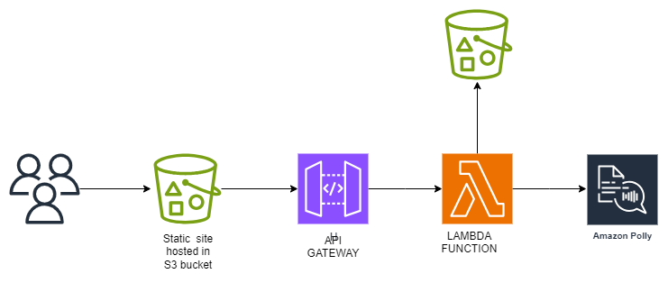

# 🎙️ Serverless Text-to-Speech Application

## 🚀 Overview
A **serverless text-to-speech application** built on AWS that converts text into natural-sounding speech using:
- **Amazon Polly** → Converts text into speech with multiple voices and formats
- **AWS Lambda** → Serverless backend processing
- **Amazon S3** → Stores generated audio files
- **Amazon API Gateway** → REST API endpoint with CORS support
- **Terraform** → Infrastructure as Code for deployment

## 🏗️ Architecture




## ✨ Features

- **Multiple Voice Options**: 13 different voices (US, UK, AU accents)
- **Audio Formats**: MP3, OGG Vorbis, PCM support
- **Speed Control**: 5 speed settings (x-slow to x-fast)
- **Real-time Processing**: Instant audio generation
- **Secure URLs**: Pre-signed S3 URLs with expiration
- **CORS Support**: Cross-origin requests enabled
- **Rate Limiting**: API throttling and quotas
- **Responsive UI**: Mobile-friendly interface

## 📁 Project Structure

```
Project-text-to-speech/
├── backend/                    # Infrastructure & Lambda code
│   ├── lambda.py              # Lambda function (Python)
│   ├── provider.tf            # AWS provider configuration
│   ├── variables.tf           # Terraform variables
│   ├── Api.tf                 # API Gateway configuration
│   ├── lambda.tf              # Lambda function setup
│   ├── s3.tf                  # S3 bucket configuration
│   ├── Iam.tf                 # IAM roles and policies
│   ├── Polly.tf               # Amazon Polly configuration
│   └── monitoring.tf          # CloudWatch monitoring
├── frontend/                   # Web interface
│   ├── index.html             # Main web application
│   └── config.js              # API configuration
├── .gitignore                 # Git ignore rules
└── README.md                  # This file
```

## 🔧 Prerequisites

- AWS account with appropriate permissions
- AWS CLI installed and configured
- Terraform >= 1.0
- Python 3.9+ (for Lambda)

### Required AWS Permissions
```json
{
  "Version": "2012-10-17",
  "Statement": [
    {
      "Effect": "Allow",
      "Action": [
        "polly:SynthesizeSpeech",
        "s3:PutObject",
        "s3:GetObject",
        "lambda:*",
        "apigateway:*",
        "iam:*",
        "logs:*"
      ],
      "Resource": "*"
    }
  ]
}
```

## ⚙️ Setup & Deployment

### 1. Clone Repository
```bash
git clone <repository-url>
cd Project-text-to-speech
```

### 2. Configure Variables
Edit `backend/variables.tf` to customize:
```hcl
variable "aws_region" {
  default = "us-east-1"
}

variable "txt_2_speech_audio_bucket" {
  default = "your-unique-audio-bucket-name"
}
```

### 3. Deploy Infrastructure
```bash
cd backend
terraform init
terraform plan
terraform apply
```

### 4. Update Frontend Configuration
After deployment, update `frontend/config.js` with your API endpoint:
```javascript
window.API_CONFIG = {
    baseUrl: 'https://your-api-id.execute-api.us-east-1.amazonaws.com/prod/speech'
};
```

### 5. Deploy Frontend (Optional)
Host the frontend on S3 static website or any web server.

## 🎯 API Usage

### Endpoint
```
POST https://your-api-id.execute-api.us-east-1.amazonaws.com/prod/speech
```

### Request Body
```json
{
  "text": "Hello, this is a test message",
  "voice": "Joanna",
  "outputFormat": "mp3",
  "speed": "medium"
}
```

### Response
```json
{
  "success": true,
  "data": {
    "audioUrl": "https://s3.amazonaws.com/bucket/audio-file.mp3",
    "voice": "Joanna",
    "format": "mp3",
    "textLength": 28,
    "expiresAt": "2024-01-01T12:00:00Z"
  }
}
```

### Available Options

**Voices:**
- `Joanna`, `Matthew`, `Ivy`, `Justin` (US English)
- `Amy`, `Brian`, `Emma` (UK English)  
- `Nicole`, `Russell` (Australian English)

**Formats:**
- `mp3` (default)
- `ogg_vorbis`
- `pcm`

**Speeds:**
- `x-slow`, `slow`, `medium`, `fast`, `x-fast`

## 🔒 Security Features

- **Input Sanitization**: XSS protection
- **CORS Configuration**: Controlled cross-origin access
- **Rate Limiting**: 50 requests/second, 1000/day quota
- **Pre-signed URLs**: Temporary access to audio files
- **IAM Roles**: Least privilege access

## 📊 Monitoring

The application includes CloudWatch monitoring for:
- Lambda function metrics
- API Gateway request/response metrics
- Error tracking and logging

## 💰 Cost Optimization

- **Serverless Architecture**: Pay only for usage
- **S3 Lifecycle**: Automatic cleanup of old audio files
- **API Throttling**: Prevents unexpected charges
- **Efficient Lambda**: Optimized for cold starts

## 🚀 Usage Examples

### cURL
```bash
curl -X POST https://your-api-endpoint/speech \
  -H "Content-Type: application/json" \
  -d '{
    "text": "Hello World",
    "voice": "Joanna",
    "outputFormat": "mp3",
    "speed": "medium"
  }'
```

### JavaScript
```javascript
const response = await fetch('https://your-api-endpoint/speech', {
  method: 'POST',
  headers: { 'Content-Type': 'application/json' },
  body: JSON.stringify({
    text: 'Hello World',
    voice: 'Joanna',
    outputFormat: 'mp3',
    speed: 'medium'
  })
});
const data = await response.json();
```

## 🔧 Troubleshooting

### Common Issues

1. **CORS Errors**: Ensure API Gateway CORS is properly configured
2. **Lambda Timeout**: Increase timeout for large text inputs
3. **S3 Permissions**: Verify Lambda has S3 write permissions
4. **Audio Not Playing**: Check browser audio format support

### Logs
Check CloudWatch logs:
```bash
aws logs describe-log-groups --log-group-name-prefix "/aws/lambda/text-to-speech"
```

## 📝 License

This project is licensed under the MIT License.

## 🤝 Contributing

1. Fork the repository
2. Create a feature branch
3. Commit your changes
4. Push to the branch
5. Create a Pull Request

## 📞 Support

For issues and questions:
- Check CloudWatch logs for errors
- Review AWS service limits
- Verify IAM permissions
- Test with minimal text input first